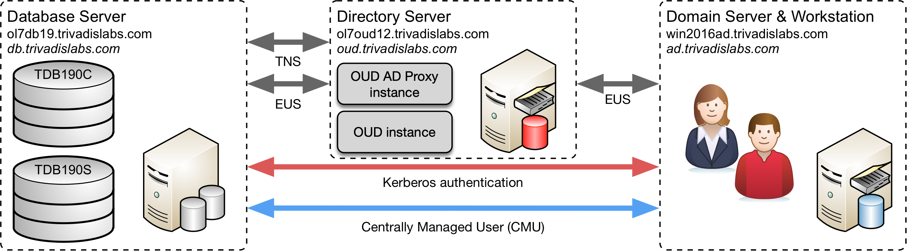

# Einleitung Oracle Centrally Managed User 18c/19c

Mit der Live-Demo Oracle Centrally Managed User 18c/19c wird die Active Directory Integration am Beispiel der Trivadis Demo und Lab Umgebung aufgezeigt. Die Live-Demo wird am AOUG Hands-On Tag im Rahmen der Anwenderkonferenz 2019 durchgeführt. Die Testumgebung besteht, wie man in der folgenden Abbildung sehen kann, jeweils aus drei virtuellen Systemen.

* DB Server mit Oracle 19c
* Windows Server 2016 mit MS Active Directory
* OUD Server mit OUD 12.2.1.3.0 für die LDAP Namensauflösung

Optional können für weitere Tests zusätzliche VM's mit Oracle 18c, 12c oder 11g genutzt werden.


*Abb. 1: Architektur Lab Umgebung*

Wichtigsten Login Informationen im Überblick:

* Datenbank Server (Linux VM)
    * **Host Name :** ol7db19.trivadislabs.com
    * **Host Alias:** db.trivadislabs.com
    * **Interne IP Adresse :** 10.0.0.19
* Directory Server (Linux VM)
    * **Host Name :** ol7oud12.trivadislabs.com
    * **Host Alias:** oud.trivadislabs.com
    * **Interne IP Adresse :** 10.0.0.5
* Active Directory Server (Windows VM)
    * **Host Name :** win2016ad.trivadislabs.com
    * **Host Alias:** ad.trivadislabs.com
    * **Interne IP Adresse :** 10.0.0.4
* Benutzer und Passwörter
    * root / gemäss Referent oder SSH Key
    * oracle / gemäss Referent oder SSH Key
    * sys / manager
    * system / manager
    * TRIVADISLABS\\Administrator / gemäss Referent
    * Allgemein AD User ist Nachname/LAB01schulung

Das Login erfolgt jeweils via vagrant respektive ssh. Alternativ kann man auch direkt mit SSH oder Putty auf den weitergeleiteten Port zugreifen.

```bash
vagrant ssh
sudo su - oracle
```

Im Kapitel [Demo- und Lab Umgebung](#demo--und-lab-umgebung) wird die Testumgebung etwas ausführlicher beschrieben. Zusätzlich besteht die Möglichkeit, selber eine eingene Testumgebung aufzubauen. Hierzu gibt es ein GitHub Repository [oehrlis/trivadislabs.com](https://github.com/oehrlis/trivadislabs.com) mit entsprechender Dokumentation, Scripts, Vagrant Files etc. um die Trivadis LAB Umgebung basierend auf Oracle [Virtualbox](https://www.virtualbox.org/wiki/Downloads) und [vagrant](https://www.vagrantup.com) nahezu vollautomatisch lokal aufzubauen.
